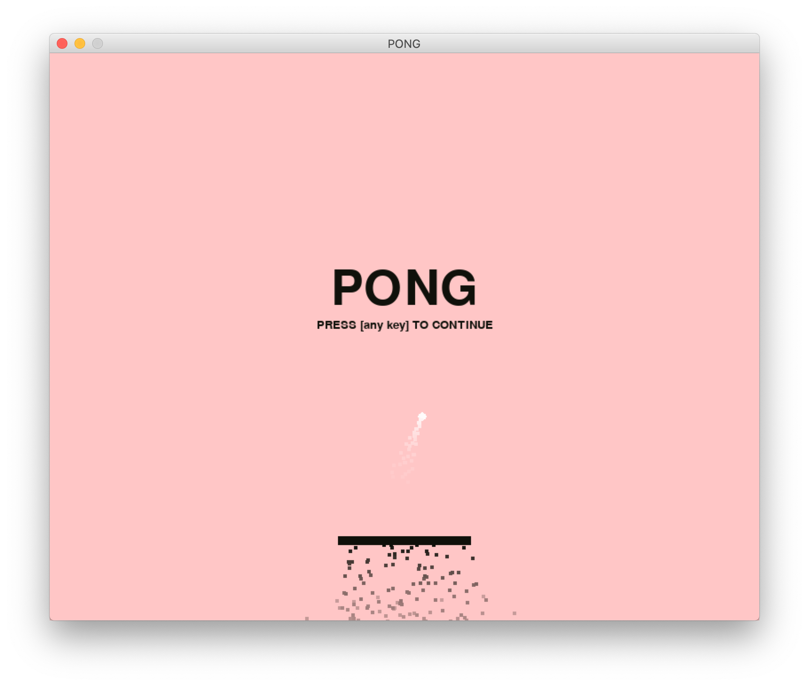

# PONG #
> particle effects!

> minimalistic

> [mostly finished]

PONG is a classic but *way* over-coded pong game
- [x] minimalistic graphics
- [x] objective oriented
- [x] collision detection and hitboxes
- [x] particle effects
- [x] pause menu

### Prerequisites ###

```bash
$ pip3 install pygame
```
and `python3` of course

### demo ###

```bash
$ git clone https://github.com/mightbesimon/PONG.git
$ cd PONG
$ python3 run.py
```

### keybinds ###
- [P] = toggle pause
- [C] = toggle cheats
- [F] = toggle show FPS
- [H] = toggle show collision box
- [B] = toggle show bounds box
- [T] = toggle particles
- [Q] = quit

## Authors ##

- **simon** - *<del>buy my merch</del> hire me pls* - [mightbesimon](https://github.com/mightbesimon)

## License ##

took me a very long time, all rights reserved

## Acknowledgments ##

- Simon rather be clubbing next time
- Simon missed lectures to do this
- don't be like Simon
- also lectures are actually useless
- lectures are now cancelled lmao
- shoutout covid-19
- clubs are now cancelled too fml
